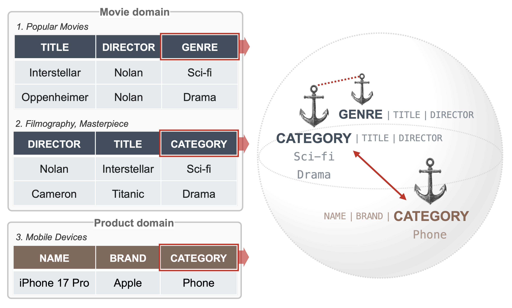

<div align="center">

# Segment-driven Structural Induction and Semantic Alignment for Heterogeneous Tabular Representation
  
[](https://icml.cc/) [](https://arxiv.org/abs/2606.01890)

</div>

Official implementation of **NAVI**, a dual-context pretraining framework for heterogeneous in-domain table representation learning.

<p align="center">
  <a href="NAVI.png">
    
  </a>
</p>

NAVI learns domain-specialized attribute semantics by jointly aggregating two complementary sources of evidence:
1) **Schema Context**: structural evidence from co-occurring attributes within a table schema, captured through masked reconstruction over header–value pairs.
2) **Column Context**: distributional evidence from all corresponding values in a table, captured through column-entropy-guided contrastive alignment.

## Environment Setup

```bash
# Create conda environment from specification
conda env create -f environment.yml

# Activate environment
conda activate navi
```

## Data Preparation

### Download Datasets
The datasets used for training are publicly available at Web Data Commons (`https://webdatacommons.org/structureddata/schemaorgtables/2023/`).
We constructed our pretraining data from the Top-100 subsets of the Product and Movie domains.

### Directory Structure

Raw data should be placed under `data/raw/...`. The preprocessing pipeline will create all derived artifacts under `data/flattened/...` and `data/cleaned/...`:

```text
data/
├── raw/
│   ├── Movie_top100/              # Raw Movie tables
│   │   ├── Movie_*.jsonl
│   │   └── ...
│   └── Product_top100/            # Raw Product tables
│       ├── Product_*.jsonl
│       └── ...
├── flattened/
│   ├── Movie_top100/              # Flattened Movie tables
│   └── Product_top100/            # Flattened Product tables
└── cleaned/
    ├── Movie_top100/              # Cleaned per-table Movie data
    ├── Product_top100/            # Cleaned per-table Product data
    ├── Movie/
    │   ├── train/                 # 80% split per cleaned Movie table
    │   ├── validation/            # 10% split per cleaned Movie table
    │   └── test/
    │       ├── WDC_movie_for_mp.jsonl
    │       └── WDC_movie_for_cls.jsonl
    └── Product/
        ├── train/                 # 80% split per cleaned Product table
        ├── validation/            # 10% split per cleaned Product table
        └── test/
            ├── WDC_product_for_mp.jsonl
            └── WDC_product_for_cls.jsonl
```

### Preprocessing

```bash
python dataset/preprocess.py
```

## Usage

### Training

Pretrain on the Movie domain (swap `Movie` → `Product` in paths and `*_movie` → `*_product` in output dirs for Product). Checkpoints at `epoch_2` are used by downstream experiments (`config.CHECKPOINT_EPOCH`).

```bash
python training/train_bert.py \
  --data_path data/cleaned/Movie/train \
  --validation_dir data/cleaned/Movie/validation \
  --output_dir models/bert_movie \
  --num_epochs 2

python training/train_navi.py \
  --data_path data/cleaned/Movie/train \
  --validation_dir data/cleaned/Movie/validation \
  --output_dir models/navi_movie \
  --masking_strategy HVB \
  --ablation_type full \
  --num_epochs 2

python training/train_tapas.py \
  --data_path data/cleaned/Movie/train \
  --validation_dir data/cleaned/Movie/validation \
  --output_dir models/tapas_movie \
  --num_epochs 2

python baselines/haetae/train.py \
  --data_path data/cleaned/Movie/train \
  --validation_dir data/cleaned/Movie/validation \
  --output_dir models/haetae_movie \
  --num_epochs 2
```

### Experiments

#### Masked Prediction
```bash
python experiments/masked_prediction/masked_prediction.py --model baselines --domain Movie
python experiments/masked_prediction/masked_prediction.py --model baselines --domain Product
```

#### Row Classification
```bash
python experiments/downstream_tasks/row_classification.py --mode lm_encoders --domain Movie --embedding_type cls
python experiments/downstream_tasks/row_classification.py --mode fe_pipelines --domain Product --embedding_type meanpooled
python experiments/downstream_tasks/row_classification.py --mode ablations --domain Movie --embedding_type cls
```

#### Header Clustering

*Prerequisites*: Canonical sets are prepared in `artifacts/lexvar/`.

```bash
python experiments/header_clustering/get_header_embeddings.py \
    --data_dir data \
    --artifacts_dir artifacts/lexvar \
    --domains cleaned/Movie cleaned/Product \
    --models bert tapas haetae navi

python experiments/header_clustering/header_clustering.py \
    --artifacts_dir artifacts/lexvar \
    --domains cleaned/Movie cleaned/Product \
    --models bert tapas haetae navi
```

#### Robustness Analysis

```bash
python experiments/robustness_analysis/robustness_exp.py
python experiments/robustness_analysis/robustness_exp.py --domains cleaned/Movie
python experiments/robustness_analysis/robustness_exp.py --domains cleaned/Product
```

**Creating Schema Noise Datasets:**
```bash
python experiments/robustness_analysis/create_schema_noise_datasets.py \
    --domain Movie \
    --synonym_map artifacts/schema_noise/synonym_map.json
```

#### Segment Visualization
```bash
python experiments/visualization/get_segment_embeddings.py \
    --model_path ./models/navi_movie/epoch_2 \
    --output_path ./artifacts/segment_visualization/segments \
    --n_tables 5 \
    --rows_per_table 169 \
    --random_state 42

python experiments/visualization/plot_segments.py \
    --input ./artifacts/segment_visualization/segments/segments.json \
    --outdir ./artifacts/segment_visualization/plots \
    --model-name "Navi" \
    --umap-n-neighbors 30 \
    --umap-min-dist 0.05 \
    --tsne-perplexity 30 \
    --seed 42 \
    --preprocessing l2_normalize
```